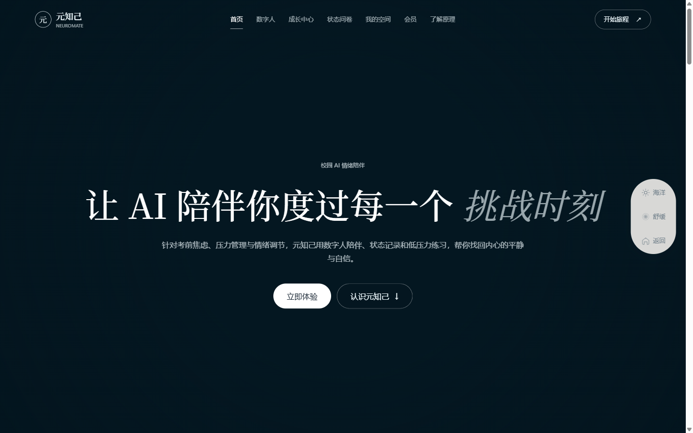
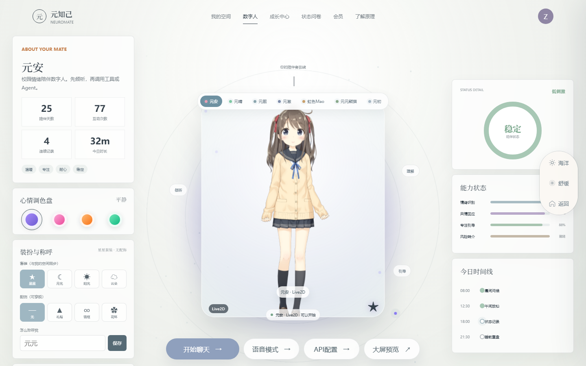
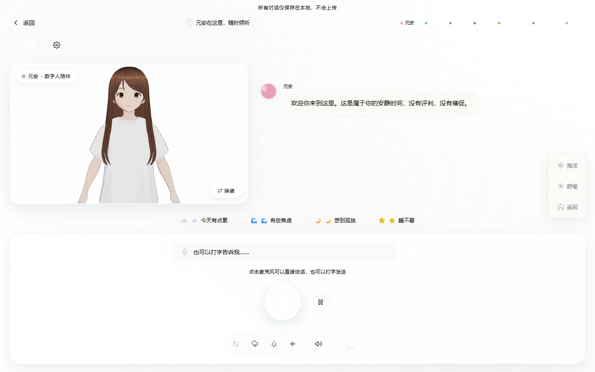
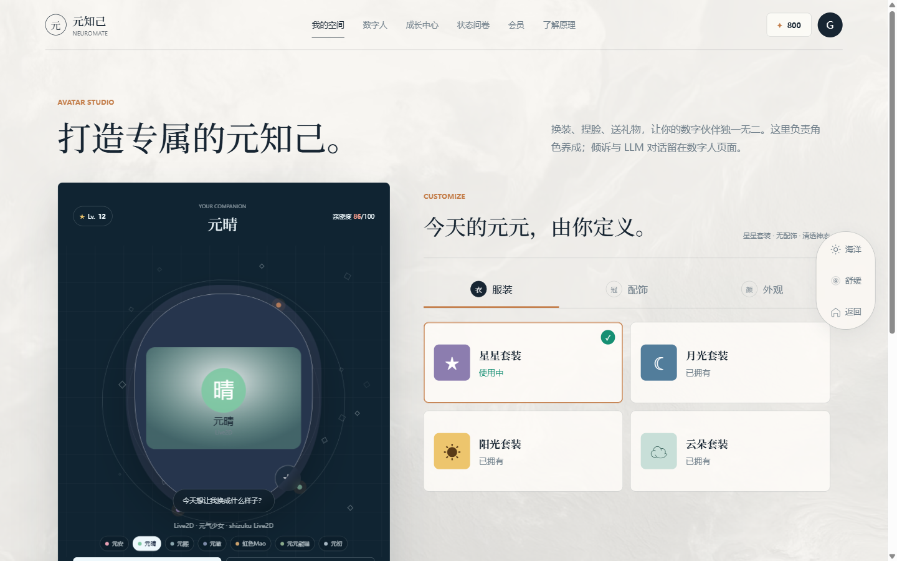
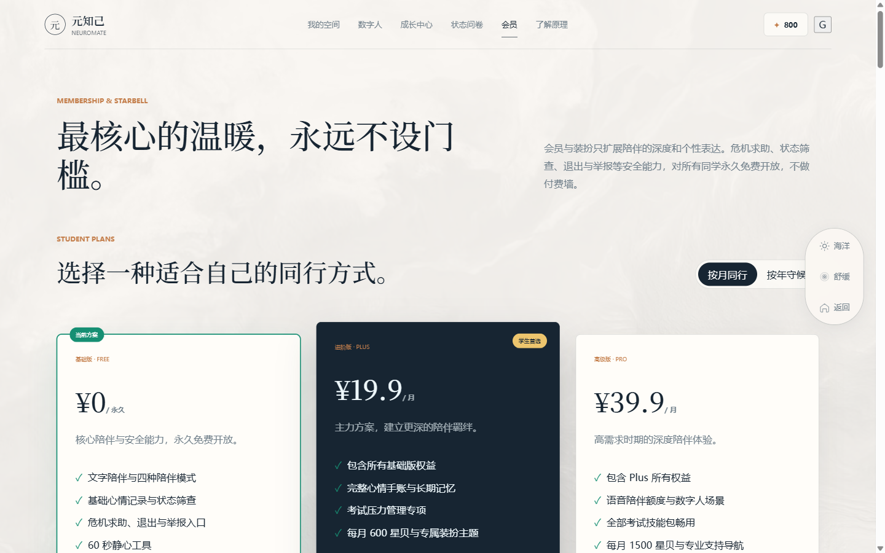
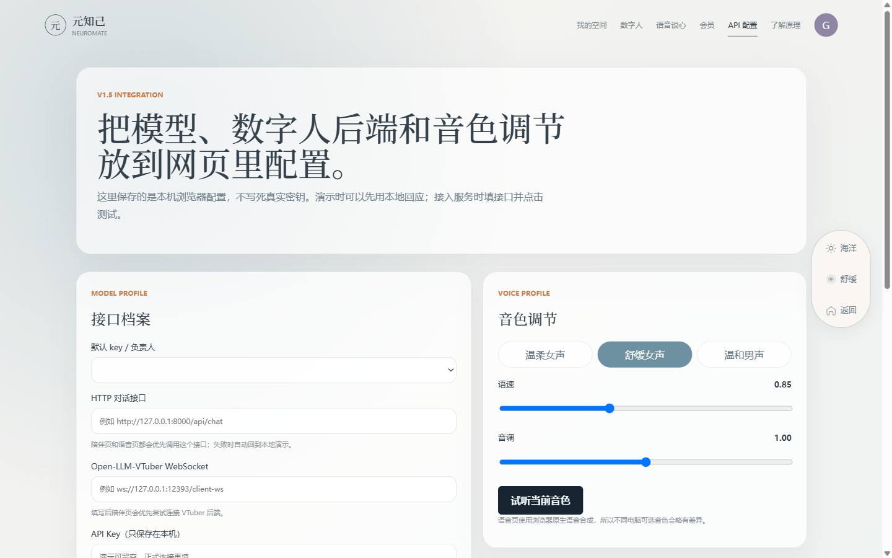

<div align="center">

# 元知己 Neuromate

**校园 AI 情绪陪伴应用 · V1.6.8 视觉收尾版**

[](https://github.com/xm2284/neuromate)
[](LICENSE)
[](https://github.com/xm2284/neuromate/actions)
[](https://github.com/xm2284/neuromate)
[](https://github.com/xm2284/neuromate)

一个面向校园场景的 AI 情绪陪伴应用。7 个数字人形象、装扮、语音、心情系统、开发配置页和本地 Agent 接口完整整合，**本地即可演示，断网也能展示核心流程**。

</div>

---

## 目录

- [界面预览](#界面预览)
- [核心特性](#核心特性)
- [数字人形象一览](#数字人形象一览)
- [功能模块详解](#功能模块详解)
- [快速开始](#快速开始)
- [本地 API 接口](#本地-api-接口)
- [技术栈](#技术栈)
- [演示与验收重点](#演示与验收重点)
- [常见问题](#常见问题)
- [版本历程](#版本历程)
- [项目结构](#项目结构)
- [相关文档](#相关文档)
- [License](#license)

---

## 界面预览

<table>
  <tr>
    <td width="50%"></td>
    <td width="50%"></td>
  </tr>
  <tr>
    <td align="center"><b>首页</b> · 项目介绍与首屏视频</td>
    <td align="center"><b>数字人陪伴页</b> · 主舞台 + 7 形象切换</td>
  </tr>
  <tr>
    <td width="50%"></td>
    <td width="50%"></td>
  </tr>
  <tr>
    <td align="center"><b>语音页</b> · 音色跟随当前角色</td>
    <td align="center"><b>我的空间</b> · 角色卡 + 装扮</td>
  </tr>
  <tr>
    <td width="50%"></td>
    <td width="50%"></td>
  </tr>
  <tr>
    <td align="center"><b>会员与星贝</b> · 会员权益体系</td>
    <td align="center"><b>API 配置</b> · 开发/评审入口，学生界面默认隐藏</td>
  </tr>
</table>

## 核心特性

- **三类数字人统一渲染**：Live2D、视频、静态兜底，由 `companion-renderer.js` 统一接管，加载失败自动回退，不留空框。
- **优先展示高完成度形象**：默认展示元安 Live2D；角色切换顺序为元安、元晴、元澈、虹色Mao、元元熊猫、元瑶、元初，保证完成度更高的形象先出现。
- **全局角色同步**：角色选择写入 `neuromate-avatar-mode-v16`，并兼容旧版 `neuromate-avatar-mode-v15`；数字人页、语音页、我的空间读取同一份选择。
- **装扮系统**：元瑶支持静态皮肤换装，其他不支持的角色会灰掉选项并说明原因，不再假装都能换。
- **语音与音色**：语音页跟随当前角色，状态文案、气泡头像、音色预设同步切换，支持语速 / 音高调节，并显示本机实际命中的中文音色。
- **心情与状态**：心情调色盘联动背景、语录、输入提示与数字人反馈，最近一次心情持久化保存。
- **开发接口可配置**：独立配置页填写 / 保存 / 测试后端接口；学生主界面默认隐藏该入口，演示可留空并使用本地回复，正式接入建议走后端代理。
- **离线演示兜底**：本地服务提供 `/api/chat` 和 `/api/agent-cluster/analyze`，未接后端时也能完成聊天与 Agent 协作展示。
- **数据管理入口**：全局浮控条提供本地演示数据导出、清空、异常反馈占位和退出陪伴；正式数据操作后续接学校服务器。
- **成长中心示例数据**：首页热力图和成长中心月历跟随当前年月，并明确标注为离线示例，不冒充真实个人记录。
- **本地启动**：`启动演示.bat` 一键启动，也可 `node _local-server.js` 起本地服务器。

## 数字人形象一览

| 形象 | 类型 | 说明 |
| --- | --- | --- |
| 元安 | Live2D | 默认主形象 · 温柔学姐 |
| 元晴 | Live2D | 元气少女 |
| 元澈 | Live2D | 沉稳学长 |
| 虹色Mao | Live2D | 官方示例角色 · 魔术少女 |
| 元元熊猫 | 视频 | 治愈熊猫视频形象 |
| 元瑶 | 静态 JPG | 换装少女形象 · 离线稳定展示 |
| 元初 | 静态 | 兜底形象 · 低性能设备可用 |

## 功能模块详解

### 首页 `index.html`

- 首屏展示项目介绍与 `home-hero.mp4` 视频
- 数字人展示区使用元初静态形象
- 关闭页面淡出过渡，减轻切页时的纸片感和卡顿

### 数字人陪伴页 `companion.html`

- 数字人直接内嵌主舞台，不再使用 iframe 嵌套
- 舞台尺寸加大，Live2D / 视频 / 静态三类形象统一由 `companion-renderer.js` 接管
- 模型加载失败时自动回退到元初兜底，**不留空框**
- 操作入口：开始聊天、语音模式、大屏预览（API 配置为开发/评审入口，学生界面不展示）
- **环境场景联动**：支持白天 / 黑夜 / 雨天三种场景（`neuromate-scene-v1`），雨天含 3D 雨丝与雨声（`assets/rain.wav`），雨量已轻量化保证人物清晰
- **心情调色盘**：多档情绪色系联动页面背景、语录、输入提示与数字人反馈，最近一次心情持久化

### 语音页 `voice-chat.html`

- 读取当前角色，状态文案、气泡头像、音色预设一起同步
- 支持语速 / 音高调节，表情联动数字人反馈
- 显示本机实际命中的中文音色，学生界面不展示 API 配置入口

### 我的空间 `space.html`

- 角色卡片与角色切换，预览同步当前角色
- 装扮商店按服装 / 饰品 / 外观分类，换装实时同步回数字人页
- 星贝钱包跨页同步，支持星轨抽卡（含保底机制）与每日签到

### 会员与星贝 `membership.html`

- 多档订阅套餐（STUDENT PLAN PLUS / PRO），支持月 / 年购买周期切换
- 套餐对比表与支付按钮，星贝（starbell）与抽卡票（tickets）由 `wallet.js` 统一管理

### Agent 集群页 `agents.html`

- 多 Agent 链式流水线：状态识别 → 认知分析 → 记忆画像 → 行为建议 → 安全/场景分流 → 综合输出
- 输入区、JSON 预览、压力评分仪表盘（压力 / 阶段 / 行为 / 情绪）与运行轨迹面板
- 底部安全提示，异常心理状态自动引导到危机干预（热线 12356）

### 状态问卷 `questionnaire.html`

- GAD-7 + PHQ-9 双量表评估，答题节奏可选（稳 / 快 / 温和）
- 结果环形评分与等级判定，附建议文案
- 最低停留时间保护与高分危机阻断，显著提示心理援助热线 12356，一键跳转陪伴页

### 成长中心 `growth.html`

- 打卡天数、持续时长、总积分、本月贡献等计数动画
- 周视图折线趋势、呼吸柱状图（压力 / 平衡 / 节奏）
- 日历月视图、每日笔记侧栏、成就徽章与 Fortune 抽卡进度

### 登录页 `login.html`

- Canvas 水波纹背景与粒子效果
- 账号密码表单、明文切换、记住我、访客入口、PWA 注册

### API 配置页 `api-config.html`

- 支持 Profile / HTTP Endpoint / WebSocket Endpoint / API Key / Model / Rate / Pitch 等配置
- 支持测试连接、预览配置状态，保存在浏览器 `localStorage`
- 演示阶段留空即可使用本地离线回复

## 快速开始

```bash
git clone https://github.com/xm2284/neuromate.git
cd neuromate
```

**方式一 · 双击启动**：直接运行 `启动演示.bat`。

**方式二 · Node 本地服务器**：

```bash
node _local-server.js 8321
```

浏览器访问 <http://localhost:8321>，即可体验完整流程：登录 → Agent 协作 → 数字人陪伴 → 语音聊天 → 我的空间换装。

> API 配置说明：`api-config.html` 保留为开发/评审配置页，学生界面默认不展示入口。演示阶段可以不填写 API Key，本地服务会使用可展示的离线回复。若填写真实 Key，配置会保存在本机浏览器 `localStorage` 中；正式部署建议把真实 Key 放在后端代理服务里。

## 本地 API 接口

`_local-server.js`（零依赖 Node 静态服务器）提供以下 mock 接口，断网也能完成演示：

| 接口 | 方法 | 说明 |
| --- | --- | --- |
| `/api/chat` | POST | 本地离线回复，未接后端时聊天可用 |
| `/api/agent-cluster/analyze` | POST | Agent 集群分析 mock 接口 |
| `/api/membership/plans` | GET | 会员套餐数据 |

## 技术栈

| 模块 | 技术 |
| --- | --- |
| Live2D | pixi-live2d-display + Live2D Cubism Core |
| 页面框架 | 原生 HTML / CSS / JavaScript |
| 语音 | Web Speech API（浏览器内置中文音色） |
| 状态存储 | localStorage（角色、装扮、心情跨页同步） |
| 本地服务 | Node.js 零依赖静态服务器 |
| CI | GitHub Actions 站点完整性检查 |

## 演示与验收重点

- 默认打开优先展示元安 Live2D，角色切换顺序固定为元安、元晴、元澈、虹色Mao、元元熊猫、元瑶、元初。
- API 配置页仍保留，但学生主流程不再出现突兀的 API 配置按钮。
- 雨天场景为轻量氛围效果，雨丝密度和音量已降低，避免遮挡数字人。
- Agent 协作页保留后端接口契约；本地服务器已提供可用 mock 接口，断网仍可演示。
- `integrations/digital-human-demo/model/live2d/shizuku/sounds/` 中少量 mp3 为历史示例动作音效占位，不属于核心语音能力；核心语音以语音页和 API/浏览器语音能力为准。

## 常见问题

**Q：为什么有些页面是原生 HTML/CSS/JS，不用框架？**
A：项目面向课程展示与本地演示场景，原生实现零依赖、启动快、易评审，配合 `companion-renderer.js` 统一接管复杂渲染逻辑。

**Q：不配置 API Key 能体验全部功能吗？**
A：可以。演示阶段本地服务器提供 `/api/chat` 与 `/api/agent-cluster/analyze` mock 接口，未接后端也能完整走完"Agent 协作 → 数字人陪伴 → 语音聊天"主流程。

**Q：数字人加载很慢或加载失败怎么办？**
A：渲染器内置三类形象自动回退：Live2D / 视频加载失败会回退到静态兜底（元初），不会留空框；低性能设备建议优先使用元瑶静态形象。

**Q：装扮会同步到数字人页吗？**
A：会。我的空间换装后实时同步回数字人页（当前由元瑶静态换装支持，其他角色若暂不支持会在商店灰显并说明原因）。

**Q：API Key 保存在哪里？安全吗？**
A：演示阶段保存在本机浏览器 `localStorage`，不会上传到任何服务器。正式部署建议把真实 Key 放在后端代理服务中。

**Q：心理危机干预是怎么实现的？**
A：状态问卷内置 GAD-7 / PHQ-9 双量表与高分危机阻断逻辑，识别到高风险状态会显著提示心理援助热线 12356，并提供一键跳转陪伴页。

## 版本历程

| 版本 | 时间 | 做了什么 |
| --- | --- | --- |
| V1.0 | 2026-07 | 第一阶段整合成品：首页 / 登录 / 我的空间 / 数字人 / 成长中心 / 状态问卷 6 页静态交互原型，海洋暖光单主题，融合第一阶段 11 位成员作品（戴昀瑾首页、许薛懿登录水帘、王嘉倪空间与成长、石若曦数字人、GAD-7 问卷等）。 |
| V1.2 | 2026-08 | 第二阶段首轮整合：扩展为 8 页，加入订阅制会员、双主题（海洋 / 莫兰迪）、星贝钱包跨页同步、Agent 集群页、语音谈心页。 |
| V1.3 | 2026-08 | 9 页版：补齐三主题（海洋 / 莫兰迪 / 深海深色），Agent 页升级 6-Agent 链（含记忆画像）与安全分流，登录页琴弦水帘交互发声，问卷增加最短停留与高分危机阻断（12356 热线），我的空间上线星轨抽卡（80 保底）、直购与签到。 |
| V1.4 | 2026-08 | 第三阶段数字人深化：数字人形象正式上线，语音对话表情联动，陪伴页数字人入口。 |
| V1.5 | 2026-08 | 完整整合版：Live2D / 视频 / 静态兜底统一渲染，装扮与名字跨页联动，语音与音色预设，心情调色盘，API 配置页，本地服务器与离线兜底，MIT LICENSE 与站点检查 CI。 |
| V1.6.8 | 2026-09 | 当前版：统一 7 个数字人展示顺序，默认元安，元瑶放在元初前；删除元熙及其 3D 换装分支入口；装扮系统按真实支持范围显示，不能换的选项会灰掉并提示；雨天效果和雨声音量继续降低；学生界面隐藏 API 配置入口，保留开发/评审配置页；首页视频保留但取消人物封面图；语音页补齐实际音色显示和刷新；补齐数据管理、新手提示、成长中心当前月份、登录/语音移动端检查；完成 27 张截图和增强功能测试。 |

## 项目结构

```text
neuromate/
├── index.html             首页（项目介绍 + 首屏视频）
├── companion.html         数字人陪伴页（主舞台 + 形象切换）
├── voice-chat.html        语音页（音色与角色同步）
├── space.html             我的空间（角色卡 + 装扮）
├── membership.html        会员与星贝
├── agents.html            Agent 集群协作
├── growth.html            成长中心
├── questionnaire.html     状态问卷（GAD-7 + PHQ-9）
├── api-config.html        API 配置
├── companion-renderer.js  数字人统一渲染器
├── site-avatar-registry.js 全局角色注册表
├── wallet.js              星贝 / 抽卡票 / 皮肤状态管理
├── integrations/
│   └── digital-human-demo/  Live2D / VRM 渲染与模型
├── models/                VRM 模型
├── assets/                视频、音频、图片与纹理资源
├── docs/screenshots/      README 截图
└── .github/workflows/     站点完整性检查（CI）
```

## 相关文档

- [README-V1.6-完整整合说明.md](README-V1.6-完整整合说明.md) — 版本演进、兼容性与已知限制

## License

[MIT](LICENSE) © 2026 元知己项目组