# 元知己 V1.6.8 视觉修复前后对比

检查时间：2026-09-06  
项目目录：`E:\学院大挑\元知己-V1.6完整整合版`

## 截图目录

| 类型 | 目录 |
| --- | --- |
| 修改前截图 | `test-results/before-v1.6/` |
| 修改后截图 | `test-results/after-v1.6/` |
| 自动截图报告 | `test-results/after-v1.6/visual-report.json` |
| 专项功能报告 | `test-results/after-v1.6/smoke-report.json` |

## 重点页面左右对比

说明：左边是修改前，右边是修改后。图片使用项目内相对路径，直接在 Markdown 预览里可以看到。

### 首页桌面

| 修改前 | 修改后 |
| --- | --- |
| 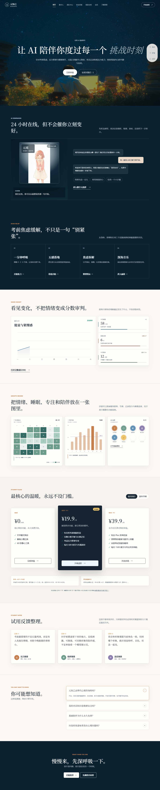 | 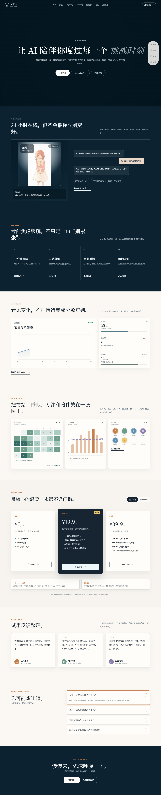 |

✅ 检查结论：视频背景保留；首屏人物封面图已删除，默认显示干净深色背景；内部“评委”视角文案已删除。

### 首页手机

| 修改前 | 修改后 |
| --- | --- |
|  |  |

✅ 检查结论：首屏不再出现人物封面；按钮可见，视频不会自动抢资源；页面没有脚本报错。

### 登录手机

| 修改前 | 修改后 |
| --- | --- |
| 无专项旧图 | 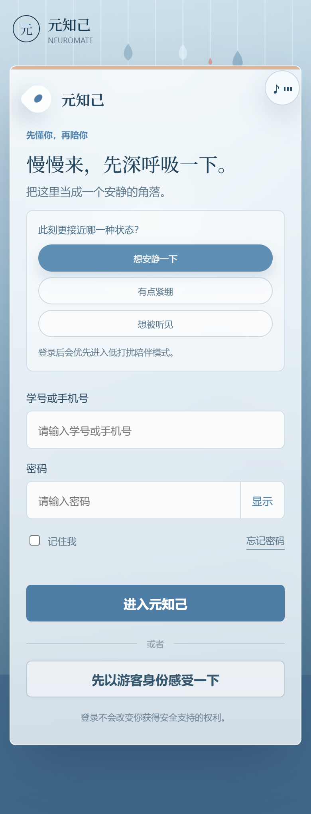 |

✅ 检查结论：登录按钮和游客入口清楚可见；页面可下滑，音乐按钮不再压住游客入口。

### 数字人桌面

| 修改前 | 修改后 |
| --- | --- |
| 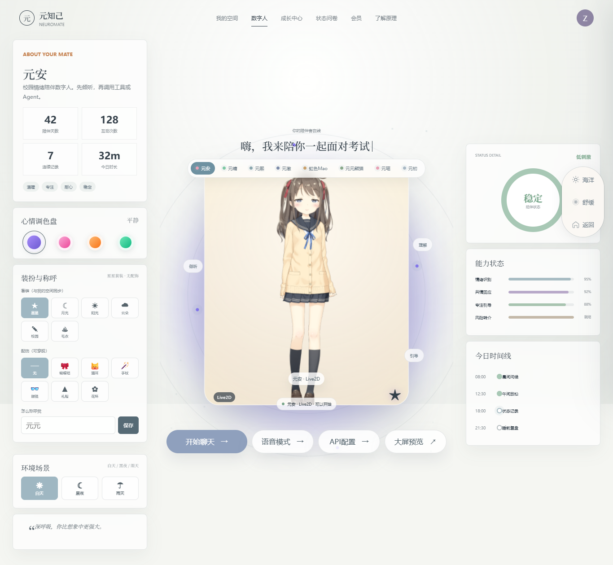 | 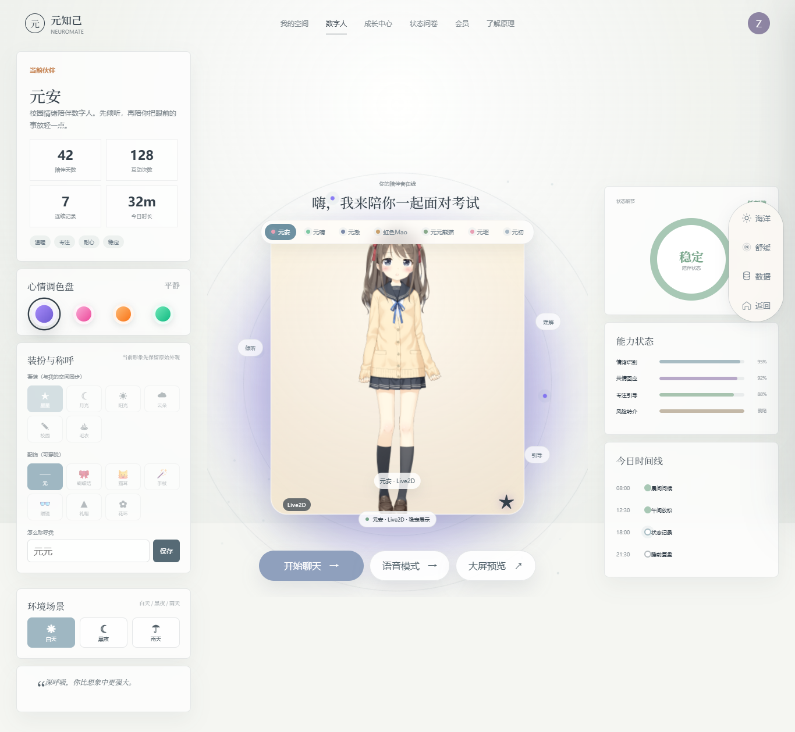 |

✅ 检查结论：默认元安，角色顺序正确，学生端没有 API 配置按钮；主按钮没有被 canvas 挡住。

### 数字人雨天

| 修改前 | 修改后 |
| --- | --- |
| 无专项旧图 | 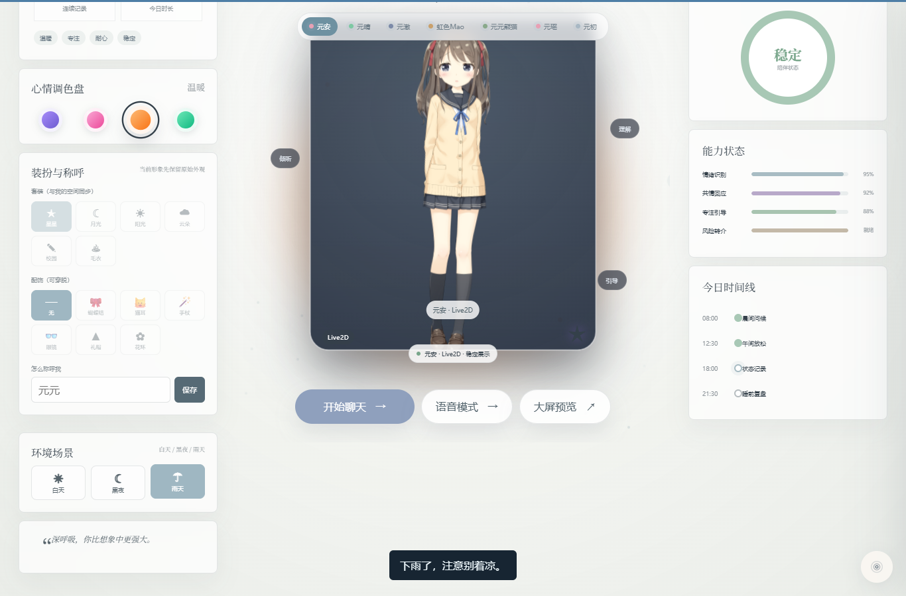 |

✅ 检查结论：雨天只能主动切换；雨效很淡，没有挡住脸和按钮，雨声默认不响。

### 数字人手机

| 修改前 | 修改后 |
| --- | --- |
| 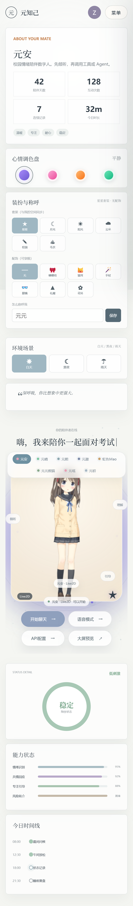 | 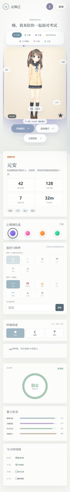 |

✅ 检查结论：手机首屏先看到数字人和主要操作；角色切换条已避开人物头部，按钮没有挤到不可点。

### 我的空间桌面

| 修改前 | 修改后 |
| --- | --- |
| 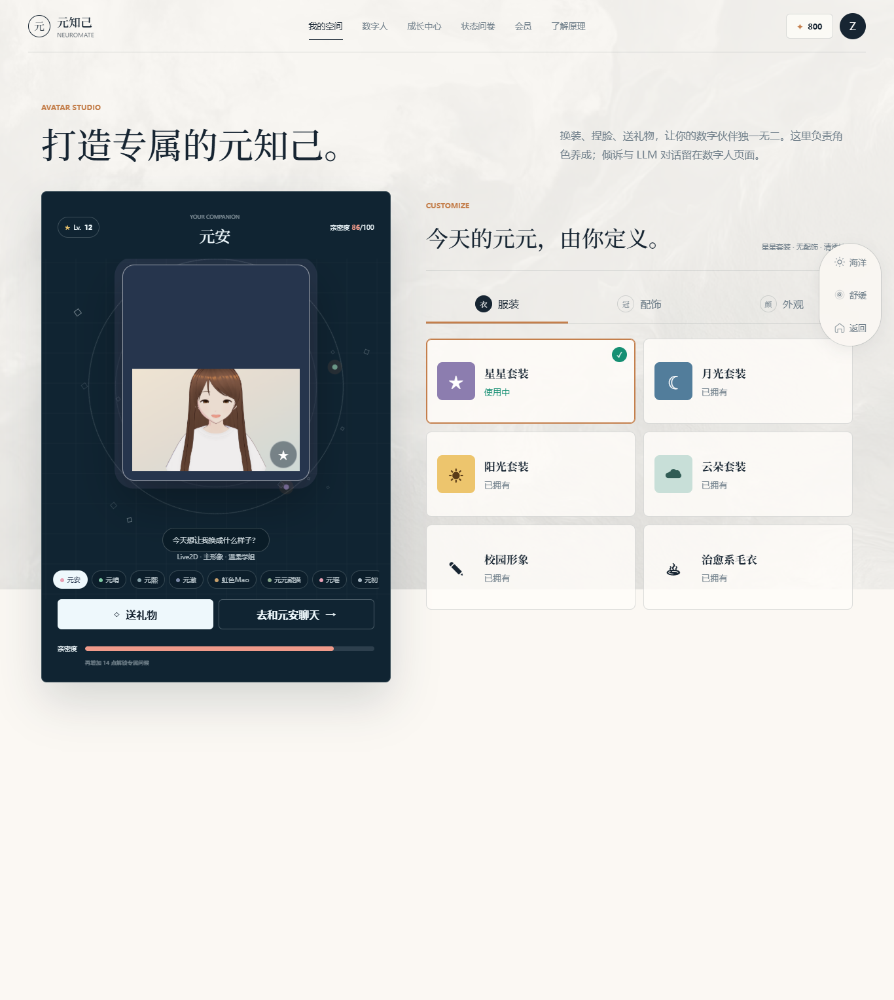 | 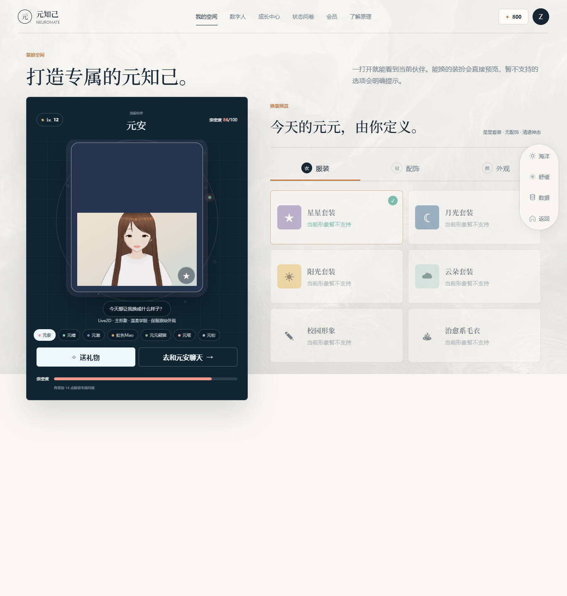 |

✅ 检查结论：默认元安，预览从抽象卡片改为清晰人物图；不支持的装扮明确灰掉并提示，英文模板小标题已改成中文。

### 我的空间手机

| 修改前 | 修改后 |
| --- | --- |
| 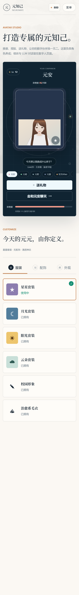 | 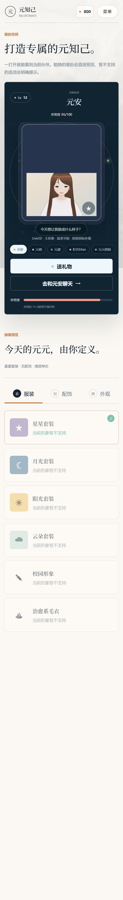 |

✅ 检查结论：首屏能看到当前伙伴；装扮按钮不会假装适配所有角色，送礼物和聊天入口可见。

### 成长中心桌面

| 修改前 | 修改后 |
| --- | --- |
| 无专项旧图 | 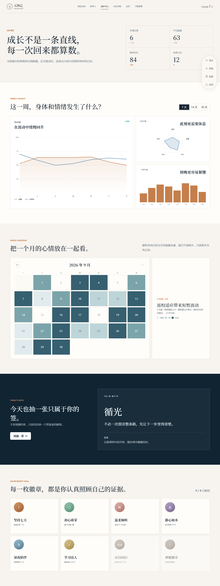 |

✅ 检查结论：月历跟随当前时间，截图为 2026 年 9 月；数据已标注为离线示例。

### 语音桌面

| 修改前 | 修改后 |
| --- | --- |
| 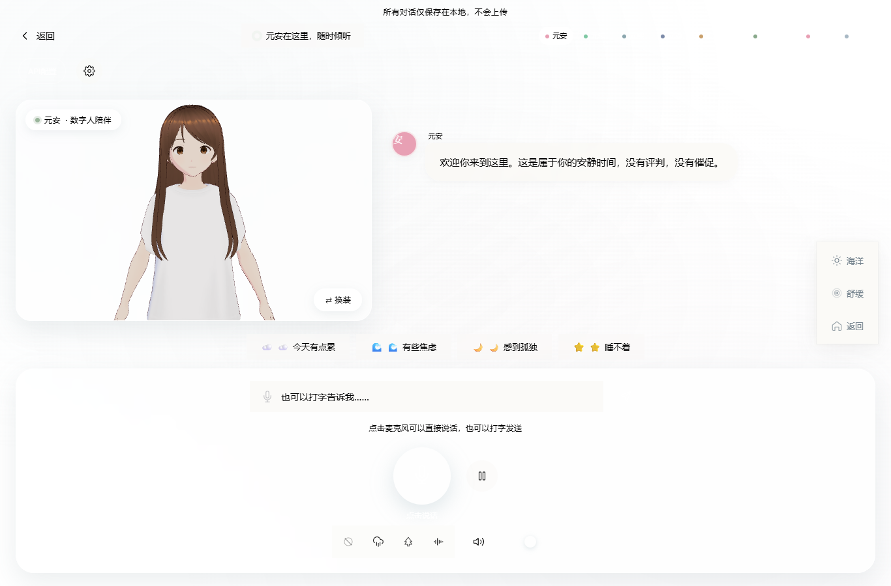 | 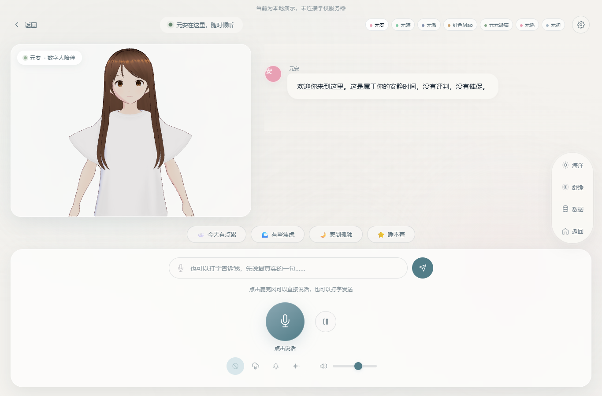 |

✅ 检查结论：颜色变量补齐后，顶部角色按钮可读；输入框、发送、麦克风和环境音控件不重叠；设置面板能看到实际音色。

### 语音设置手机

| 修改前 | 修改后 |
| --- | --- |
| 无专项旧图 | 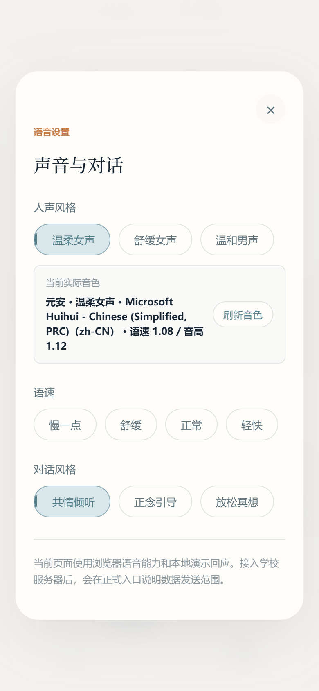 |

✅ 检查结论：实际音色卡片可读，刷新按钮没有撑破面板，学生端不会看到 API 配置入口。

### 语音手机

| 修改前 | 修改后 |
| --- | --- |
| 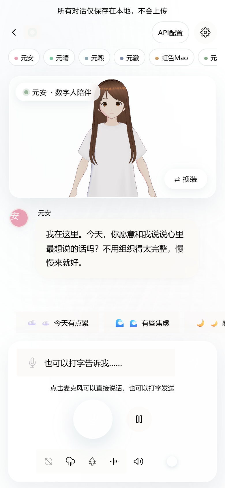 | 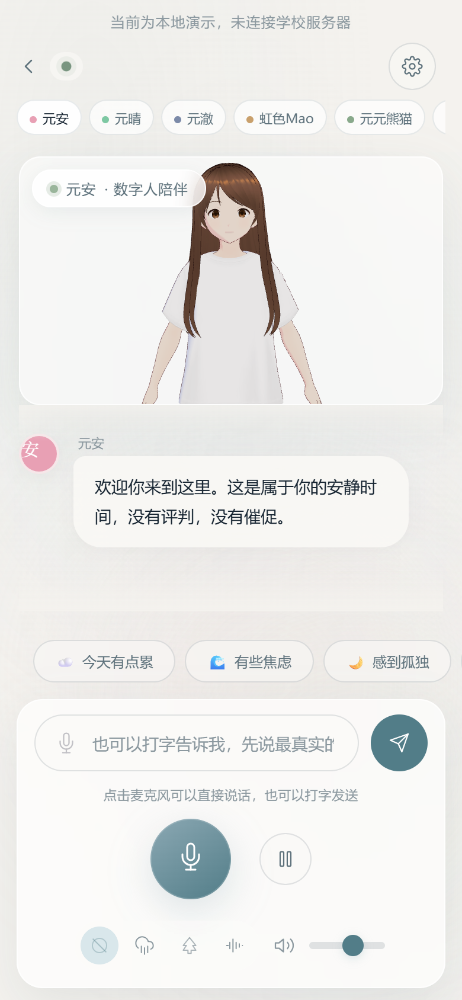 |

✅ 检查结论：API 配置入口已隐藏；底部输入与麦克风分开，语音不可用时会走文字输入，音色状态不会撑破面板。

### 问卷桌面

| 修改前 | 修改后 |
| --- | --- |
| 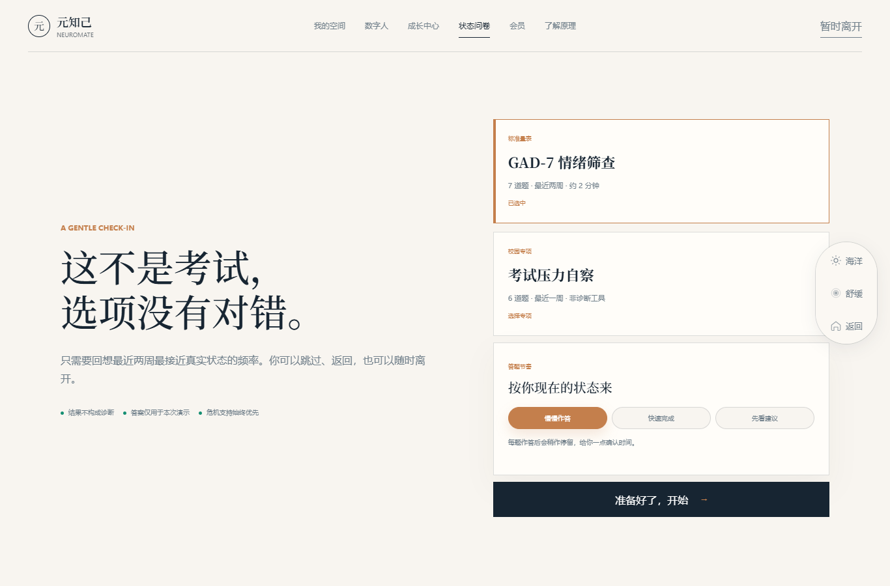 |  |

✅ 检查结论：页面布局稳定；高分路径已专项测试，12356 不再写成短信，提供拨打和复制号码。

### 会员桌面

| 修改前 | 修改后 |
| --- | --- |
| 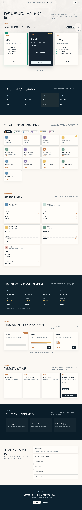 | 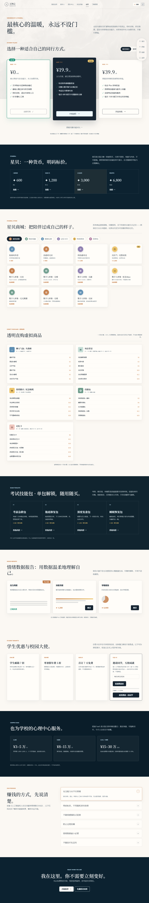 |

✅ 检查结论：页面无脚本错误；付费/星贝仍明确是原型模拟，真实支付留到服务器阶段。

## 功能验收

| 检查项 | 结果 | 说明 |
| --- | --- | --- |
| 首页视频背景 | 通过 | `#heroVideo` 保留；已无 autoplay 和人物 poster，按钮可切换播放/暂停。 |
| 首页快捷按钮 | 通过 | 快捷对话、呼吸练习弹窗和数据管理入口都已点击验证。 |
| 登录入口 | 通过 | 登录提交按钮可见，游客入口可进入我的空间。 |
| 数字人默认元安 | 通过 | 清空本地缓存后首次进入为元安。 |
| 数字人顺序 | 通过 | 元安、元晴、元澈、虹色Mao、元元熊猫、元瑶、元初；元熙已删除。 |
| 元瑶位置 | 通过 | 元瑶只在元初前面，不在第一位。 |
| 学生端 API 隐藏 | 通过 | 数字人页、语音页没有 API 配置入口；配置页仍可直接访问。 |
| 雨天切换 | 通过 | 点击雨天后切换成功，雨效不挡人物和按钮。 |
| 空间抽卡 | 通过 | 签到、打开抽卡、抽出结果、刷新余额/次数/保底均无脚本错误。 |
| 成长中心日期 | 通过 | 首页热力图和成长中心月历都跟随当前月份，不再固定 7 月。 |
| 会员套餐状态 | 通过 | 年付切换、Plus 弹窗确认、当前方案标记已验证。 |
| 全局主题 | 通过 | 海洋/莫兰迪/深海可切换，主题可跨页保持。 |
| 离线接口 | 通过 | `/api/chat` 与 `/api/agent-cluster/analyze` 均返回本地演示结果。 |
| 问卷高分热线 | 通过 | 高分结果出现 12356 拨打和复制入口，无短信误导。 |
| 控制台错误 | 通过 | 27 张桌面/手机截图全部无 console error。 |

## 剩余边界

这些不是漏修，而是当前没有服务器时不应该假装完成：

| 项目 | 说明 |
| --- | --- |
| 真实账号登录 | 需要服务器、数据库和会话管理。 |
| 真实会员权限 | 必须服务端判断，纯前端做不可信。 |
| 真实支付/退款 | 需要正式支付渠道和合规规则。 |
| 心理安全话术终审 | 明显错误已修，最终表述建议由心理专业老师复核。 |
| 第三方资源授权台账 | 需要单独逐项确认模型、音频、图片来源。 |
